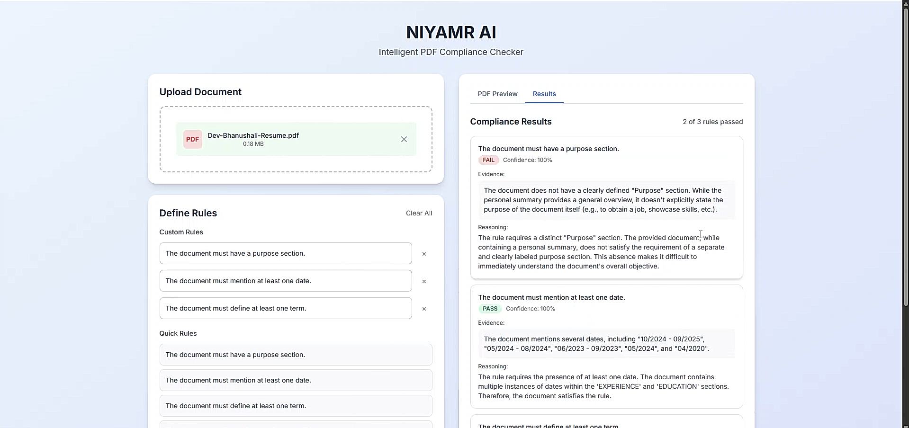

# AI – PDF Rule Checker

A professional AI-powered tool that audits PDFs against custom rules and returns structured JSON results. Built with **React**, **Node.js**, and the **Gemini API**, it provides an interactive user interface with real-time results.

---

## Features

- Upload PDFs directly via the browser.
- Define custom rules for auditing.
- AI-powered document checking using Gemini API.
- Interactive table showing results: Pass/Fail, Evidence, Reasoning, Confidence.
- Clean, minimal, and professional UI.
- Handles multiple rules in a single upload.

---

## Tech Stack

- **Frontend:** React, Tailwind CSS
- **Backend:** Node.js, Express
- **AI API:** Gemini API (Google Generative AI)
- **PDF Parsing:** `pdf-parse-fixed`
- **File Storage:** Local temporary storage

---

## Setup Instructions

### Prerequisites
- Node.js v18+  
- npm or yarn  
- Gemini API Key  

### Backend
1. Navigate to backend folder:
   ```
   cd backend
   npm install
   npm start
   ```

2. Navigate to Frontend folder:
   ```
   cd fronted
   npm install
   npm run dev
   ```

## Screenshots & Demo Video
## Check out [Demo Video](https://drive.google.com/file/d/1SYhh9JZqRJMGMdoQa5u2IIwYpSShjGtt/view?usp=sharing) 


